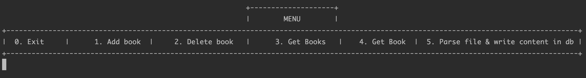

# Book Library

### Description
This Books Library console application is dedicated to show the core abilities of 
Spring & Hibernate frameworks.
The project was used in <a href="https://www.it-academy.by">IT-Academy</a> as 
a training sandbox while learning spring & hibernate frameworks during java course.
Later it was refactored to satisfy the modern standards of Software Development.

System name: **book-library**

### Getting Started
#### Step 1 - Setup database
* Setup MySql database on your environment
* Run [create_schema.sql](.schema/create_schema.sql)
#### Step 2 - Checkout the project
#### Step 3 - Adjust application configuration
* Adjust [](src/main/resources/application.yaml) configuration for your environment
```yaml
spring:
  datasource:
    username: ${database.username}
    password: ${database.password}
    url: jdbc:mysql://${database.url}/book_library
```
#### Step 4 - Build
```bash
$ mvn -U clean install
```
#### Step 5 - Run
```bash
$ mvn spring-boot:run
```

### Menu:

